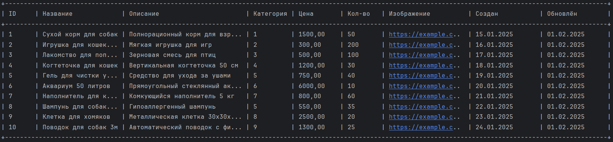

# Отчет по лаботаротоной работе №1. Gradle. Базовое приложение Spring
## Цель работы
Создать каркас приложения и разобраться с конфигурированием Spring приложений на основе Java-классов, написать загрузчик CSV файлов.
## Выполнение работы
1. Скачан и установлен [Axiom Standard JDK 17.0.15](https://axiomjdk.ru/pages/downloads/#/java-17-lts).
2. Скачан и установлен [Gradle 8.12.1](https://gradle.org/releases/).
3. С помощью Gradle, в директории [les02/lab](/les02/lab/) создан проект вида Java Applications с помощью руководства [руководства по установке](https://docs.gradle.org/current/samples/sample_building_java_applications.html).

   Проект был создан с помощью команды ``gradle init --package ru.bsuedu.cad.lab``. В нем были указаны следующие настройки:

    * имя проекта - *product-table*,
    * тип проекта - *application*,
    * язык проекта - *java*,
    * версия языка - *17*,
    * структура проекта - *single application project*,
    * DSL - *Kotlin*,
    * фреймворк для проверки - *JUnit Jupiter*.

4. В проект были добавлены библиотеки:
    * ``org.springframework:spring-context:6.2.2``,
    * ``org.springframework:spring-core:6.2.2``,
    * ``org.springframework:spring-beans:6.2.2``,
    * ``org.springframework:spring-context-support:6.2.2``.
5. Было реализовано приложение, удовлетворяющее следующим требованиям:
    * приложение должно представлять собой консольное приложение разработанное с помощью фреймворка Spring и конфигурируемое с помощью Java-конфигурации;
    * приложение должно читать данные о товарах для магазина из [csv-файла](/les02/assets/product.csv) и выводить его в консоль в виде таблицы.

   На рисунке ниже представлен вывод данных CSV-файла в таблицу.

   

   Код приложения располагается в директории [les02/lab](/les02/lab/) и реализован в соответствии с предложенной UML-диаграммой.
## Выводы
Создан каркас приложения и сконфигурировано Spring приложение на основе Java-классов, написан загрузчик CSV файлов.
## Контрольные вопросы
### 1. Spring. Определение, назначение, особенности.
Spring - легковесный фреймворк(каркас) для построения приложений любого уровня на Java.

Spring можно применять для построения любого приложения на языке Java (например, автономных, веб-приложений или корпоративных приложений на Java), в отличие от многих других фреймворков (например Apache Struts предназначенного только для создания веб-приложений.)

Ключевые особенности:
* инверсия управления,
* модульная архитекутра,
* автоконфигурация приложений,
* гибкая работа с данными с помощью JPA,
* использование паттерна MVC.

### 2. Проблемы ручной сборки приложений.
* человеческий фактор (ошибки и непоследовательность),
* долгое и неэффективное выполнение,
* отсутствие стандартизации,
* сложность управления зависимостями,
* отсутствие автоматического тестирования,
* проблемы с CI/CD и DevOps.
### 3. Перечислите известные вам вам системы автоматической сборки. Кратно расскажите про каждую из них.
1. Maven
* XML-конфигурация (`pom.xml`),
* жёсткая структура проекта,
* кэширование зависимостей,
* плагины для тестирования, упаковки, развёртывания.
2. Gradle
* конфигурация на Groovy/Kotlin DSL (`build.gradle`),
* инкрементальные сборки (быстрее Maven),
* гибкая система задач (tasks),
* поддержка многомодульных проектов.
3. Ant
* конфигурация в XML (`build.xml`),
* императивный подход (ручное описание шагов),
* гибкость, но требует больше кода,
* устарел, но используется в legacy-проектах.
### 4. Типовая структура Java проекта.
      project-root/
      ├── src/
      │ ├── main/
      │ │ ├── java/      # Исходные коды приложения
      │ │ ├── resources/ # Ресурсы и конфигурации
      │ │ └── webapp/    # Веб-компоненты 
      │ └── test/
      │ ├── java/        # Тестовые классы
      │ └── resources/   # Тестовые ресурсы
      ├── target/        # Сгенерированные файлы 
      │ ├── classes/
      │ └── generated-sources/
      ├── lib/           # Внешние библиотеки
      ├── build.gradle   # Конфигурация Gradle (или pom.xml для Maven)
      └── README.md      # Описание проекта
### 5. Типы зависимостей в Gradle.
* `implementation`,
* `api`,
* `compileOnly`,
* `runtimeOnly`,
* `testImplementation`,
* `testRuntimeOnly`.
### 6. Что такое принцип инверсии управления? Для чего применяется?
* **Определение**: Архитектурный принцип передачи управления объектами и их жизненным циклом контейнеру (фреймворку)
* **Применение**:
    - Уменьшение связанности компонентов
    - Упрощение тестирования (подмена зависимостей)
    - Централизация управления объектами
    - Реализация модульности
* **Пример**:
  ```java
  @Service
  public class OrderService {
      @Autowired // Зависимость внедряется контейнером
      private PaymentService paymentService;
  }
  ```
### 7. В чем отличие инверсии управления от внедрения зависимостей?

* **IoC** — архитектурный принцип передачи управления:
    - Контейнер управляет жизненным циклом объектов
    - Общий подход к организации кода
    - Пример: Шаблон "Фабрика", Service Locator

* **DI** — частный случай реализации IoC:
    - Конкретный механизм передачи зависимостей
    - Внедрение через конструктор/сеттеры/поля
    - Пример в Spring:
   ```java
     @Service
     public class UserService {
         private final UserRepository repo;
         
         @Autowired // DI через конструктор
         public UserService(UserRepository repo) {
             this.repo = repo;
         }
     }
   ```
* **Ключевое отличие**:
    - IoC — *что* (передача управления)
    - DI — *как* (способ передачи зависимостей)
### 8. Принципы инверсии управления. Перечислите, кратко расскажите про каждый.
1. Dependency Injection (DI) — Внедрение зависимостей. Объекты получают свои зависимости извне, а не создают их самостоятельно.
2. Service Locator — Локатор служб. Объекты запрашивают свои зависимости у специального объекта (локатора), который возвращает нужную реализацию.
3. Event-based IoC — Инверсия через события. Компоненты подписываются на события, а внешняя система решает, когда вызвать нужный обработчик.
### 9. Сцепление (Coupling) и связность (Cohesion).
Сцепление — это мера зависимости одного модуля (или класса) от другого. Чем сильнее один модуль зависит от другого, тем выше сцепление.
Связность — это мера того, насколько логически связаны методы и данные внутри одного модуля или класса.
### 10. Какой принцип внедрения зависимости желательно использовать. Почему?
Предпочтительным методом является - внедрение зависимостей через конструктор (Constructor Injection). Его плюсы:
1. Явная зависимость
2. Невозможность работы без зависимостей
3. Облегчает тестирование
4. Уменьшение связанности
5. Облегчает поддержку кода
6. Совместимость с IoC-контейнерами
