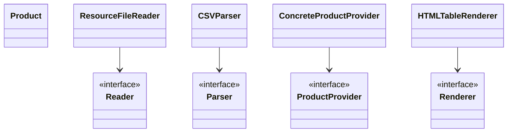

# Лабораторная работа №2

## 📌 Тема:
Конфигурирование Spring-приложения с помощью аннотаций. Применение AOP для логирования

---

## ✅ Выполнено:

- Перевод конфигурации на аннотации `@Component`, `@Value`, `@Primary`, `@PostConstruct`
- Путь к CSV-файлу берется из `application.properties` через `${product.csv.filename}`
- Добавлен `HTMLTableRenderer`, сохраняющий HTML-таблицу (`products.html`)
- Добавлен аспект `PerformanceAspect` — измеряет время парсинга CSV
- Программа выводит в консоль и сохраняет результат в HTML, затем завершает выполнение

---

## 💻 Пример вывода:

```
ResourceFileReader initialized at: 2025-05-23T00:03:16.007133900
Looking for file: products.csv
Found file? true
[AOP] CSV parsing took 6 ms
```

---

## 📄 UML-диаграмма классов (Mermaid)



---

## ❓ Вопросы для защиты

**1. Виды конфигурирования ApplicationContext:**  
XML, Java-класс с `@Configuration`, аннотационное (`@ComponentScan`)

**2. Стереотипные аннотации:**  
`@Component`, `@Service`, `@Repository`, `@Controller`, `@Configuration` — для регистрации бинов в контексте

**3. Инъекция зависимостей:**  
- `@Autowired` (по типу)
- `@Qualifier` (по имени)
- `@Primary` — приоритетный бин
- Через конструктор, поле или сеттер

**4. Внедрение параметров:**  
```java
@Value("42")
private int number;
```

**5. SpEL (`Spring Expression Language`):**  
```java
@Value("#{2 * 21}")
private int value;
```

**6. Режимы получения бинов:**  
`singleton`, `prototype`, `request`, `session`, `application`

**7. Жизненный цикл бина:**  
Создание → DI → `@PostConstruct` → Использование → `@PreDestroy`

**8. Что такое AOP:**  
Аспектно-ориентированное программирование — логика вынесена в аспект (логгинг, безопасность и т.д.)

**9. Типы AOP в Spring:**  
- Spring AOP (прокси)
- AspectJ (байткод)

**10. Виды Advice:**  
`@Before`, `@After`, `@AfterReturning`, `@AfterThrowing`, `@Around`

**11. Виды Pointcut:**  
`execution`, `within`, `args`, `bean`, `annotation`

**12. Отличие Spring AOP и AspectJ:**  
Spring AOP — на уровне прокси объектов, AspectJ — на уровне байткода, мощнее

---

## 🚀 Запуск:

```bash
gradle run --no-daemon
```