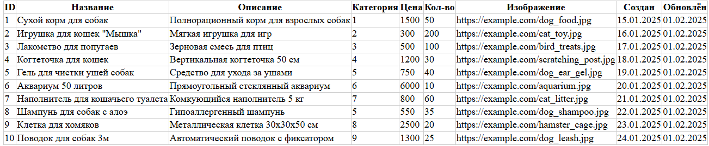
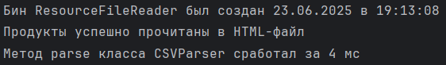

# Отчет по лаботаротоной работе №2. Конфигурирование приложение Spring c помощью аннотаций. Применение AOП для логирования
## Цель работы
Научиться конфигурировать приложение с помощью аннотаций, добавить функционал по представлению таблиц в виде HTML и измерить скорость выполнения кода с помощью инструментов АОП.
## Выполнение работы
Код приложения располагается в директории [les04/lab](/les04/lab/) и реализован в соответствии с предложенными изменениями. 

На рисунке ниже показана HTML-страницы, отображающая результат выполнения кода класса HTMLTableRenderer.



На следующем рисунке показан результат выполнения реализованного функционала измерения времени выполнения метода парсинга CSV-файла и время инцииализации бина ResourceFileReader.



## Выводы
Сконфигурировано приложение с помощью аннотаций, добавлен функционал по представлению таблиц в виде HTML и измерена скорость выполнения кода с помощью инструментов АОП.
## Контрольные вопросы
### 1. Виды конфигурирования ApplicationContext.
В Spring существует несколько способов конфигурации `ApplicationContext`:
* XML-конфигурация – традиционный способ, где бины и зависимости описываются в XML-файлах (`applicationContext.xml`).
* Аннотационная конфигурация – использование аннотаций (`@Component`, `@Service`, `@Autowired` и др.) для автоматического обнаружения и связывания бинов.
* Java-based конфигурация – конфигурация через Java-классы с аннотацией `@Configuration` и методами, помеченными `@Bean`.
* Groovy-конфигурация – конфигурация через Groovy-скрипты (менее распространённый способ).
### 2. Стереотипные аннотации. Перечислите. Расскажите для чего используются.
Стереотипные аннотации используются для автоматического обнаружения и регистрации бинов в Spring-контейнере:
* `@Component` – общая аннотация для любого Spring-бина.
* `@Service` – указывает, что класс содержит бизнес-логику.
* `@Repository` – помечает класс как DAO/репозиторий (добавляет обработку исключений, связанных с БД). 
* `@Controller` – указывает, что класс является Spring MVC-контроллером. 
* `@Configuration` – помечает класс как источник определения бинов.
Эти аннотации позволяют Spring автоматически сканировать и регистрировать бины при включении `<context:component-scan>` или `@ComponentScan`.
### 3. Инъекция зависимостей. Перечислите виды автоматического связывания. Расскажите про каждый из них.
Spring поддерживает несколько способов автоматического связывания (autowiring):
* byType – зависимость внедряется по типу (если есть единственный бин такого типа).
* byName – зависимость внедряется по имени (имя поля должно совпадать с именем бина).
* constructor – аналогично byType, но для конструктора.
* no (по умолчанию) – автопривязка отключена, зависимости указываются явно (`@Autowired` или XML).
Используется аннотация `@Autowired` (или `@Inject`/`@Resource` из JSR-330/JSR-250).
### 4. Внедрение параметров. Расскажите как внедрить простые параметры в бин.
Простые параметры (строки, числа) можно внедрять:
* Через XML:
```xml
<bean id="myBean" class="com.example.MyBean">
    <property name="name" value="John"/>
    <property name="age" value="30"/>
</bean>
```
* Через аннотации:
```java
@Component
public class MyBean {
    @Value("John")
    private String name;

    @Value("30")
    private int age;
}
```
### 5. Внедрение параметров. Расскажите как внедрить параметры с помощью SpEL.
SpEL (Spring Expression Language) позволяет вычислять значения динамически:
```java
@Component
public class MyBean {
    @Value("#{systemProperties['user.name']}")
    private String username;

    @Value("#{T(java.lang.Math).random() * 100}")
    private double randomValue;

    @Value("#{otherBean.property}")
    private String otherBeanProperty;
}
```
SpEL поддерживает вызовы методов, арифметические операции, доступ к свойствам и т. д.
### 6. Режимы получения бинов. Перечислите, кратко расскажите.
* Singleton (по умолчанию) – один экземпляр на весь контейнер.
* Prototype – новый экземпляр при каждом запросе.
* Request – один экземпляр на HTTP-запрос (только для веб-приложений).
* Session – один экземпляр на HTTP-сессию (только для веб-приложений).
* Global Session – один экземпляр на глобальную сессию (для портлетов).
Указывается через `@Scope` или в XML.
### 7. Жизненный цикл бинов.
1. Создание экземпляра (через конструктор или фабрику).
2. Заполнение свойств (инъекция зависимостей).
3. Вызов методов обратного вызова: `@PostConstruct` или `InitializingBean.afterPropertiesSet()`.
4. Бин готов к использованию.
5. Уничтожение: `@PreDestroy` или `DisposableBean.destroy()`.
Можно настраивать через XML (`init-method`, `destroy-method`) или аннотации.
### 8. Что такое АОП? Основные понятия АОП.
AOP (Aspect-Oriented Programming) – парадигма для разделения сквозной функциональности (логирование, транзакции, безопасность).
Основные понятия:
* Aspect – модуль, содержащий advice и pointcuts.
* Join Point – точка в выполнении программы (вызов метода, исключение).
* Advice – код, выполняемый в определённой точке.
* Pointcut – выражение, определяющее, где применяется advice.
* Weaving – процесс связывания аспектов с основным кодом.
### 9. Типы АОП в Spring.
* Spring AOP – работает на прокси-объектах, поддерживает только method execution join points.
* AspectJ – полноценный AOP-фреймворк с более мощными возможностями (полевые точки, статическое внедрение).
### 10. Виды Advice.
* `@Before` – выполняется перед методом.
* `@AfterReturning` – после успешного завершения метода.
* `@AfterThrowing` – если метод бросил исключение.
* `@After` (finally) – выполняется в любом случае.
* `@Around` – оборачивает метод (может изменить параметры или результат).
### 11. Виды Point Cut.
Pointcut определяет, где применяется advice:
* Execution – совпадение по сигнатуре метода `(execution(* com.example.*.*(..))`).
* Within – все методы в классе/пакете `(within(com.example.service.*)`).
* Annotation – методы с определённой аннотацией `(@annotation(com.example.Loggable)`).
* Args – методы с определёнными параметрами.
### 12. Чем Spring AOP отличается от AspectJ?
Spring AOP работает через прокси, применяется только для методов, проще в настройке и медленнее.
AspectJ является модификацией байт-кода, применяется для любых точек внедрения, сложнее, но быстрее.
