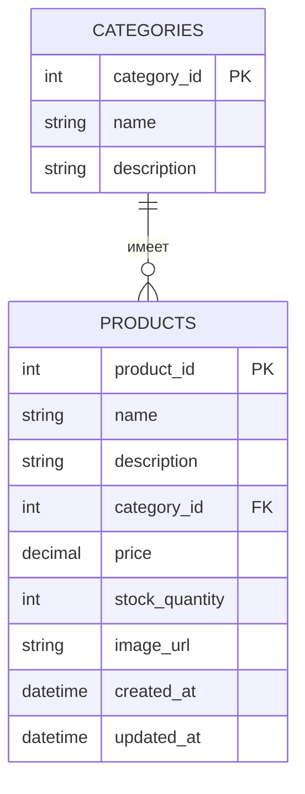
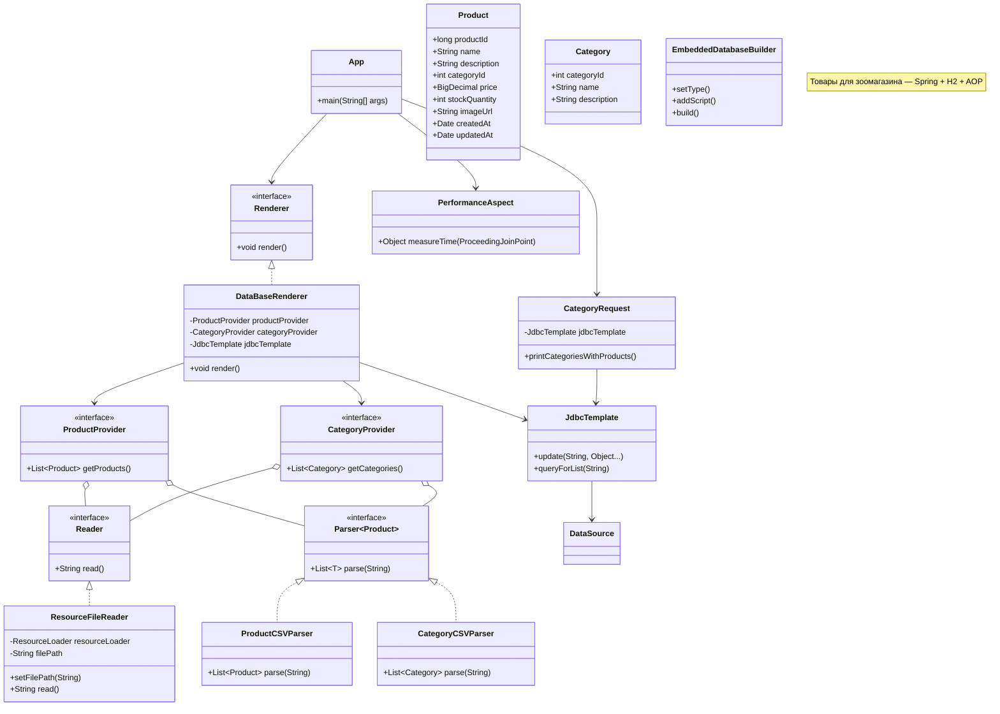

# Лабораторная работа 4. Технологии работы с базами данных.JDBC

Мы продолжаем развивать наше приложение для магазина зоотоваров 🦭.

В этой работе нам необходимо научить наше приложение сохранять данные в базе данных. А также научить наше приложение выполнять SQL запросы и выводить их результаты в логи. В этом нам поможет механизм JDBC (Java Database Connectivity), и такие инструменты Spring как DataSource, JDBCTemplate, RowMapper упрощающие работу с JDBC.

Перед началом работы ознакомитесь с [правилами выполнения и сдачи лабораторных работ](../README.md)

1. Скопируйте результат выполнения лабораторной работы № 2 в директорию [/les06/lab/](/les06/lab/)
2. Подключите к приложению встраиваемую базу данных H2 используя EmbeddedDatabaseBuilder
3. Напишите SQL скрипт создающие две  таблицы "Продукты" (PRODUCTS) и "Категории" (CATEGORIES) (не забудьте про  внешние ключи).



4. Настройте EmbeddedDatabaseBuilder так, чтобы он при старте приложения выполнял данный скрипт и создавал в базе данных таблицы CATEGORIES и PRODUCTS.
5. Для таблицы "Категории" создайте Java класс Category, для моделирования данной сущности (аналогичный классу Product). И класс ConcreteCategoryProvider, аналогичный ConcreteProductProvider, данный класс должен предоставлять данные из CSV файла [category.csv](./assets/category.csv). CSV-файл должен располагаться в директории src/main/resources  вашего приложения
6. Добавьте еще одну имплементацию интерфейса Renderer - DataBaseRenderer которая сохраняет данные считанные из SCV файлов в таблицы базы данных. Реализация DataBaseRenderer должна использоваться пол умолчанию.
7. Реализуйте класс CategoryRequest, данный класс должен выполнять запрос к базе данных получающий следующую информацию - список категорий количество товаров в которых больше единицы. Данная информация должна выводиться в консоль с помощью библиотеки для логирования logback, уровень лога INFO.
8. Приложение должно запускаться с помощью команды ```gradle run```, выводить необходимую информацию в консоль и успешно завершаться.
9. Оформите отчет о выполнении лабораторной работы в виде файла  README.md в директории [les06/lab](/les06/lab/). Отчет должен содержать обновленную  UML-диаграмму классов в формате [mermaid](https://mermaid.js.org/).

# Отчет по лабораторной работе №6

## UML-диаграмма классов (обновленная)



## Вопросы для защиты
### 1. **Что такое Spring JDBC и какие преимущества оно предоставляет по сравнению с традиционным JDBC?**

**Spring JDBC** — это абстракция для работы с базой данных, которая упрощает использование JDBC в Spring-приложениях. Он позволяет вам сосредоточиться на логике приложения, убирая необходимость вручную управлять соединениями, создавать подготовленные запросы и обрабатывать исключения.

**Преимущества**:

- **Упрощение работы с JDBC** — управление соединениями, создание и выполнение запросов осуществляется автоматически.
    
- **Обработка исключений** — Spring предоставляет собственные классы для обработки исключений (например, `DataAccessException`), что позволяет унифицировать обработку ошибок.
    
- **Поддержка транзакций** — Spring поддерживает работу с транзакциями через аннотации или декларативный подход.
    
- **Автоматическая очистка ресурсов** — ресурсы (например, соединения с базой данных, ResultSet, Statement) освобождаются автоматически.
    

---

### 2. **Какой основной класс в Spring используется для работы с базой данных через JDBC?**

Основной класс для работы с базой данных через JDBC в Spring — это **`JdbcTemplate`**. Этот класс инкапсулирует все операции, связанные с установлением соединения, выполнением запросов и обработкой результатов.

---

### 3. **Какие шаги необходимо выполнить для настройки JDBC в Spring-приложении?**

Для настройки Spring JDBC нужно выполнить следующие шаги:

1. **Добавить зависимости** — добавьте зависимость на Spring JDBC и драйвер базы данных в `pom.xml` (для Maven) или `build.gradle` (для Gradle).
    
2. **Настроить DataSource** — создайте бин `DataSource` в контексте Spring. Это может быть `BasicDataSource`, `HikariDataSource` или любой другой поставщик.
    
3. **Создать JdbcTemplate** — создайте бин `JdbcTemplate`, который будет использоваться для выполнения запросов.
    
4. **Конфигурировать подключение** — через Java-класс или XML-конфигурацию задайте параметры подключения, такие как URL, логин, пароль и другие параметры.
    

---

### 4. **Что такое JdbcTemplate и какие основные методы он предоставляет?**

**`JdbcTemplate`** — это класс, предоставляющий удобные методы для выполнения SQL-запросов, обновлений и получения результатов. Он инкапсулирует логику работы с соединениями и ресурсами.

**Основные методы**:

- `queryForObject` — выполняет запрос, возвращая один результат (например, одно значение или объект).
    
- `queryForList` — выполняет запрос, возвращая список объектов.
    
- `update` — выполняет операцию обновления (например, INSERT, UPDATE, DELETE).
    
- `query` — позволяет выполнять произвольные запросы и обрабатывать результат через `RowMapper`.
    
- `batchUpdate` — выполняет батчевые операции (например, для массовых вставок).
    

---

### 5. **Как в Spring JDBC выполнить запрос на выборку данных (SELECT) и получить результат в виде объекта?**

Для выполнения SELECT-запроса и получения результата в виде объекта в Spring JDBC используется метод `queryForObject`. Пример:

```java
String sql = "SELECT * FROM products WHERE id = ?";
Product product = jdbcTemplate.queryForObject(sql, new Object[]{id}, new BeanPropertyRowMapper<>(Product.class));
```

Здесь:

- `sql` — SQL-запрос.
    
- `new Object[]{id}` — параметры для запроса.
    
- `BeanPropertyRowMapper<>(Product.class)` — маппер, который преобразует строку результата в объект `Product`.
    

---

### 6. **Как использовать RowMapper в JdbcTemplate?**

`RowMapper` используется для преобразования строк результата SQL-запроса в объекты Java. Пример использования:

```java
public class ProductRowMapper implements RowMapper<Product> {
    @Override
    public Product mapRow(ResultSet rs, int rowNum) throws SQLException {
        Product product = new Product();
        product.setId(rs.getLong("id"));
        product.setName(rs.getString("name"));
        return product;
    }
}
```

Затем, в `JdbcTemplate`, используем этот маппер:

```java
List<Product> products = jdbcTemplate.query("SELECT * FROM products", new ProductRowMapper());
```

---

### 7. **Как выполнить вставку (INSERT) данных в базу с использованием JdbcTemplate?**

Для выполнения вставки данных можно использовать метод `update`, который выполняет операцию вставки. Пример:

```java
String sql = "INSERT INTO products (name, price) VALUES (?, ?)";
jdbcTemplate.update(sql, product.getName(), product.getPrice());
```

В этом примере `update` выполняет SQL-запрос и вставляет данные в таблицу `products`.

---

### 8. **Как выполнить обновление (UPDATE) или удаление (DELETE) записей через JdbcTemplate?**

Обновление и удаление также выполняются с помощью метода `update`. Пример для обновления:

```java
String sql = "UPDATE products SET price = ? WHERE id = ?";
jdbcTemplate.update(sql, newPrice, productId);
```

Пример для удаления:

```java
String sql = "DELETE FROM products WHERE id = ?";
jdbcTemplate.update(sql, productId);
```

---

### 9. **Как в Spring JDBC обрабатывать исключения, возникающие при работе с базой данных?**

В Spring JDBC используется иерархия исключений, начиная с `DataAccessException`. Это необработанное исключение Spring, которое инкапсулирует все ошибки, связанные с доступом к данным.

Пример обработки исключений:

```java
try {
    jdbcTemplate.update(sql, params);
} catch (DataAccessException e) {
    // Логируем ошибку или обрабатываем исключение
    e.printStackTrace();
}
```

Spring автоматически преобразует все исключения JDBC в объекты `DataAccessException`.

---

### 10. **Какие альтернативные способы работы с базой данных есть в Spring кроме JdbcTemplate?**

В Spring есть несколько альтернатив для работы с базой данных:

- **JPA (Java Persistence API)** — более высокоуровневая абстракция для работы с объектно-реляционными базами данных через `EntityManager`.
    
- **Hibernate** — фреймворк для ORM, который также интегрируется с Spring через Spring Data JPA.
    
- **Spring Data JDBC** — альтернатива Spring JDBC, которая предоставляет более удобный способ работы с реляционными базами данных, используя простой репозиторий и поддерживая POJO (Plain Old Java Object).
    
- **MyBatis** — фреймворк для работы с SQL-запросами, который позволяет маппировать результаты запросов на объекты Java, аналогично Hibernate, но с большим контролем над SQL-кодом.
