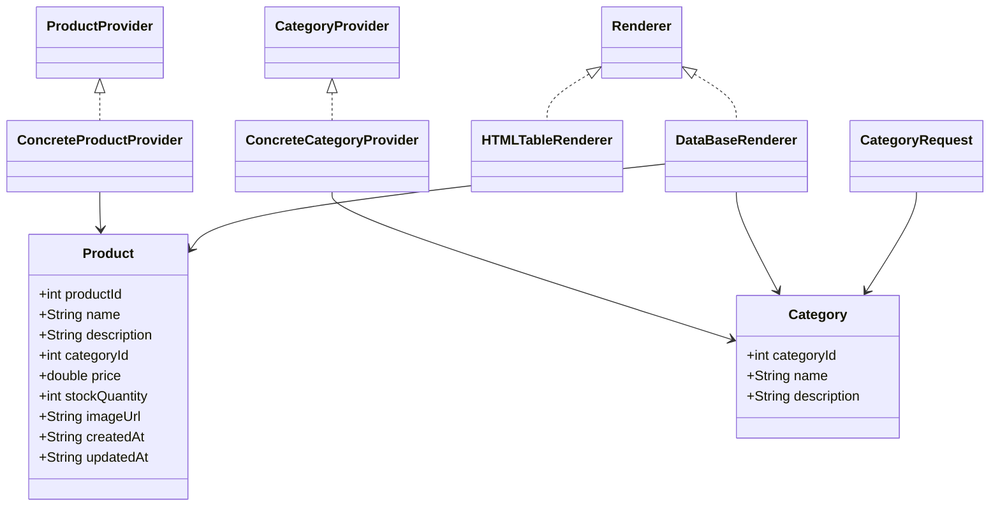

# Лабораторная работа №4

## Тема:
**Технологии работы с базами данных. JDBC**

## Цель работы:
Изучить применение Spring JDBC для взаимодействия с базой данных, реализовать сохранение и выборку данных из H2 Database.

## Ход работы:

1. **Проект скопирован из ЛР2** в директорию `les06/lab`
2. **Подключена H2-база данных** через `EmbeddedDatabaseBuilder`
3. **Создан SQL-скрипт** для таблиц `CATEGORIES` и `PRODUCTS` с внешним ключом
4. **Добавлены сущности `Category` и `Product`**
5. **Реализованы провайдеры `ConcreteCategoryProvider` и `ConcreteProductProvider`** — считывают данные из `category.csv` и `products.csv`
6. **Создан `DataBaseRenderer`** — сохраняет все данные в БД
7. **Реализован `CategoryRequest`** — выполняет SQL-запрос и логирует категории, где товаров > 1
8. **Добавлена поддержка Logback** для логирования
9. **Приложение запускается через `gradle run`** и корректно завершает выполнение
10. **Создан README и диаграмма классов**

---

## Mermaid UML-диаграмма классов



---

## Ответы на контрольные вопросы

**1. Что такое Spring JDBC и какие преимущества оно предоставляет по сравнению с традиционным JDBC?**  
Spring JDBC — это модуль Spring Framework, упрощающий работу с базой данных. Он предоставляет шаблон `JdbcTemplate`, который устраняет необходимость вручную открывать/закрывать соединения, обрабатывать исключения и управлять ресурсами.

**2. Какой основной класс в Spring используется для работы с базой данных через JDBC?**  
`JdbcTemplate`.

**3. Какие шаги необходимо выполнить для настройки JDBC в Spring-приложении?**  
- Настроить `DataSource` или использовать `EmbeddedDatabaseBuilder`
- Создать `JdbcTemplate` бин
- Создать `RowMapper` или использовать лямбда-выражения
- Выполнять SQL через `JdbcTemplate`

**4. Что такое JdbcTemplate и какие основные методы он предоставляет?**  
`JdbcTemplate` — это шаблонный класс Spring JDBC, предоставляющий методы: `query()`, `update()`, `queryForObject()`, `batchUpdate()` и др.

**5. Как в Spring JDBC выполнить запрос на выборку данных (SELECT) и получить результат в виде объекта?**  
С помощью `jdbcTemplate.query(sql, rowMapper)`.

**6. Как использовать RowMapper в JdbcTemplate?**  
Создаётся класс, реализующий интерфейс `RowMapper<T>` с методом `mapRow(ResultSet rs, int rowNum)`, где задается логика маппинга строки таблицы в объект.

**7. Как выполнить вставку (INSERT) данных в базу с использованием JdbcTemplate?**  
С помощью метода `jdbcTemplate.update("INSERT INTO ...", параметр1, параметр2, ...)`.

**8. Как выполнить обновление (UPDATE) или удаление (DELETE) записей через JdbcTemplate?**  
Также методом `update()`, например:  
```java
jdbcTemplate.update("UPDATE table SET field=? WHERE id=?", value, id);
```

**9. Как в Spring JDBC обрабатывать исключения, возникающие при работе с базой данных?**  
Spring JDBC автоматически оборачивает SQLException в `DataAccessException`, которую можно ловить в логике приложения.

**10. Какие альтернативные способы работы с базой данных есть в Spring кроме JdbcTemplate?**  
- Spring Data JPA (Hibernate)
- Spring Data R2DBC (реактивный доступ)
- Spring Data MongoDB (NoSQL)

