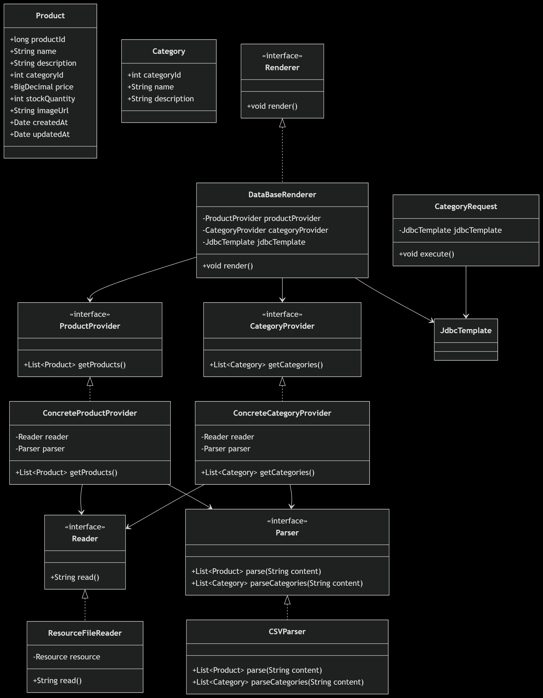
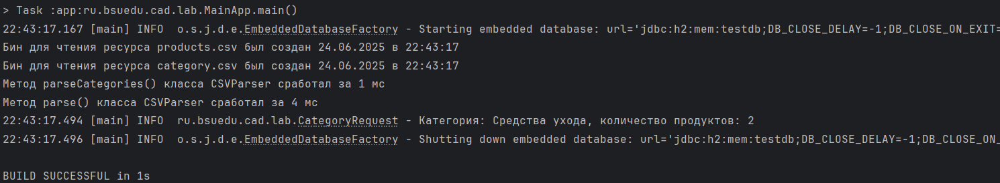

# Отчет по лаботаротоной работе №3. Технологии работы с базами данных. JDBC
## Цель работы
Научиться внедрять связь с базой данных в приложение, научиться писать SQL-запросы и выводить их результаты в логи.
## Выполнение работы
На рисунке представлена UML-диаграмма классов, дополненная новыми разработанными классами.



Код приложения располагается в директории [les06/lab](/les06/lab/) и реализован в соответствии с предложенными изменениями.

На рисунке ниже представлен результат выполнения реализованного функционала.



## Выводы
Получены навыки создания связи между базой данных и приложением, навыки написания SQL-запросов и навыки работы с логгером.
## Контрольные вопросы
### 1. Что такое Spring JDBC и какие преимущества оно предоставляет по сравнению с традиционным JDBC?
Spring JDBC — это модуль Spring Framework, который упрощает работу с JDBC. Преимущества:
* Избавляет от необходимости писать boilerplate-код (открытие/закрытие соединений, обработка исключений)
* Предоставляет удобные абстракции (JdbcTemplate, NamedParameterJdbcTemplate)
* Упрощает обработку исключений (переводит checked SQLException в unchecked DataAccessException)
* Поддерживает декларативное управление транзакциями
* Легче интегрируется с другими модулями Spring
### 2. Какой основной класс в Spring используется для работы с базой данных через JDBC?
Основной класс — `JdbcTemplate`. Он предоставляет методы для выполнения SQL-запросов, обработки результатов и обработки исключений.
### 3. Какие шаги необходимо выполнить для настройки JDBC в Spring-приложении?
1. Добавить зависимости (spring-jdbc, драйвер БД)
2. Настроить DataSource (встроенная БД, пул соединений и т.д.)
3. Создать бин JdbcTemplate, передав ему DataSource
4. Использовать JdbcTemplate в DAO-классах
### 4. Что такое JdbcTemplate и какие основные методы он предоставляет?
`JdbcTemplate` — центральный класс Spring JDBC. Основные методы:
* `query()` — для SELECT запросов 
* `queryForObject()` — для выборки одного значения 
* `update()` — для INSERT, UPDATE, DELETE
* `execute()` — для DDL операций 
* `batchUpdate()` — для пакетных операций
### 5. Как в Spring JDBC выполнить запрос на выборку данных (SELECT) и получить результат в виде объекта?
Использовать `query()` или `queryForObject()` с RowMapper:
```java
List<Product> products = jdbcTemplate.query(
    "SELECT * FROM products", 
    (rs, rowNum) -> new Product(
        rs.getLong("id"),
        rs.getString("name")
    )
);
```
### 6. Как использовать RowMapper в JdbcTemplate?
RowMapper преобразует ResultSet в объект. Можно использовать:
1. Анонимный класс
2. Лямбда-выражение
3. BeanPropertyRowMapper (если имена полей совпадают с колонками)
### 7. Как выполнить вставку (INSERT) данных в базу с использованием JdbcTemplate?
Использовать метод `update()`:
```java
jdbcTemplate.update(
    "INSERT INTO products (name, price) VALUES (?, ?)",
    "Новый продукт", 19.99
);
```
### 8. Как выполнить обновление (UPDATE) или удаление (DELETE) записей через JdbcTemplate?
Аналогично INSERT, используя `update()`:
```java
jdbcTemplate.update(
    "UPDATE products SET price = ? WHERE id = ?",
    24.99, 1L
);
jdbcTemplate.update("DELETE FROM products WHERE id = ?", 1L);
```
### 9. Как в Spring JDBC обрабатывать исключения, возникающие при работе с базой данных?
Spring преобразует SQLException в иерархию unchecked-исключений DataAccessException. Можно:
1. Ловить конкретные исключения (EmptyResultDataAccessException и др.)
2. Использовать @Transactional для автоматического отката
3. Реализовать собственные обработчики через ExceptionTranslator
### 10. Какие альтернативные способы работы с базой данных есть в Spring кроме JdbcTemplate?
* NamedParameterJdbcTemplate — для именованных параметров вместо ?
* SimpleJdbcInsert — для простых INSERT операций
* JPA/Hibernate — ORM-подход 
* Spring Data JPA — репозитории с автоматической реализацией методов 
* MyBatis — SQL-маппинг через XML/аннотации 
* R2DBC — реактивный доступ к данным