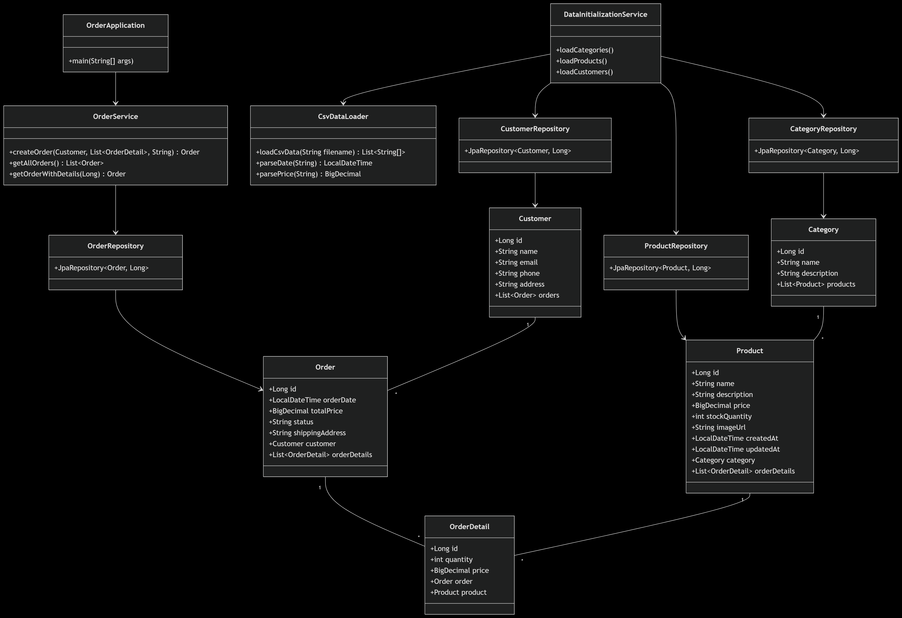
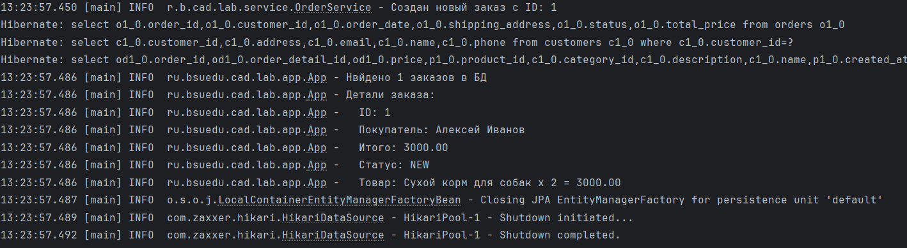

# Отчет по лаботаротоной работе №4. Технологии работы с базами данных. JPA. Spring Data
## Цель работы
Получить навыки работы с ORM Hibernate и Spring Data, расширить приложение новыми сущностями и привести его архитектуру в слоистый вид.
## Выполнение работы
На рисунке представлена UML-диаграмма классов, дополненная новыми разработанными классами.



Код приложения располагается в директории [les08/lab](/les08/lab/) и реализован в соответствии с предложенными изменениями.

На рисунке ниже представлен результат выполнения реализованного функционала.



## Выводы
Получены навыки работы с ORM Hibernate и Spring Data, приложение расширено новыми сущностями и его архитектура приведена в слоистый вид.
## Контрольные вопросы
### JPA

1. Что такое JPA и для чего оно используется?
   
JPA (Java Persistence API) — это стандарт ORM (Object-Relational Mapping) в Java, который позволяет работать с реляционными базами данных через объекты.
Используется для:
* Упрощения работы с БД (избегание ручного SQL).
* Маппинга Java-классов на таблицы БД.
* Управления транзакциями и жизненным циклом сущностей.
2. Чем JPA отличается от Hibernate?

JPA — это стандарт (интерфейс), а Hibernate — его реализация (как и EclipseLink, OpenJPA).
Hibernate предоставляет дополнительные возможности, не описанные в JPA (например, кэширование второго уровня).
3. Что делает аннотация `@Entity`?
   
Помечает класс как сущность JPA, которая будет маппиться на таблицу в БД.
4. Для чего нужна аннотация `@Table`?

Позволяет указать имя таблицы в БД, если оно отличается от имени класса.
5. Как обозначить первичный ключ в JPA?

С помощью аннотации `@Id` над полем.
6. Что делает аннотация @GeneratedValue?

Указывает, что значение первичного ключа генерируется автоматически (например, автоинкремент в БД).
7. Какие бывают стратегии генерации идентификаторов в JPA?

* `AUTO` (по умолчанию, выбор стратегии на усмотрение провайдера).
* `IDENTITY` (автоинкремент в БД).
* `SEQUENCE` (использование SQL-секвенций).
* `TABLE` (генерация через отдельную таблицу).
8. Чем отличается `@Column(name = "field_name")` от использования имени поля напрямую?

`@Column` позволяет указать имя колонки в БД, если оно отличается от имени поля. Без аннотации JPA использует имя поля как имя колонки.
9. Как задать связь “один ко многим” (@OneToMany) в JPA?

```java
@Entity
public class Order {
    @OneToMany(mappedBy = "order", cascade = CascadeType.ALL)
    private List<OrderDetail> details;
}
```
10. Как задать связь “многие ко многим” (@ManyToMany) в JPA?

```java
@Entity
public class Student {
    @ManyToMany
    @JoinTable(
        name = "student_course",
        joinColumns = @JoinColumn(name = "student_id"),
        inverseJoinColumns = @JoinColumn(name = "course_id"))
    private Set<Course> courses;
}
```

### Spring Data

1. Что такое Spring Data и зачем оно нужно?

Spring Data — это проект для упрощения работы с разными СУБД (JPA, MongoDB, Redis).
Ее плюсами является автоматическая реализация CRUD-методов и сокращение boilerplate-кода.
2. Что делает интерфейс `CrudRepository`?

Предоставляет базовые CRUD-операции.
3. Чем JpaRepository отличается от `CrudRepository`?

`JpaRepository` расширяет `CrudRepository` и добавляет:
* Пагинацию (`findAll(Pageable)`).
* Пакетное удаление (`deleteAllInBatch()`).
* Методы для работы с JPA (`flush()`).
4. Как создать свой репозиторий в Spring Data JPA?

Наследоваться от JpaRepository и добавить методы:
```java
public interface ProductRepository extends JpaRepository<Product, Long> {
    List<Product> findByName(String name);
}
```
5. Как выполнить поиск по ID с помощью Spring Data JPA?

Через метод `findById()`:
```java
Optional<Product> product = productRepository.findById(1L);
```
6. Как добавить новую запись в базу данных через Spring Data JPA?

Через метод `save()`:
```java
Product product = new Product();
productRepository.save(product);
```
7. Как удалить объект из базы данных в Spring Data JPA?

Через `delete()`:
```java
productRepository.delete(product);
```
8. Как написать свой SQL-запрос в Spring Data JPA?

Использовать `@Query`:
```java
@Query("SELECT p FROM Product p WHERE p.price > :price")
List<Product> findExpensiveProducts(@Param("price") BigDecimal price);
```
9. Что такое @Transactional и зачем она нужна?

Аннотация для управления транзакциями. Автоматически открывает/закрывает транзакцию. Применяется к методам или классам.
10. Какие аннотации нужны для работы с JPA-сущностями?

`@Entity`, `@Table`, `@Id`, `@GeneratedValue`, `@Column`, `@OneToMany`, `@ManyToOne`, `@Transactional`.