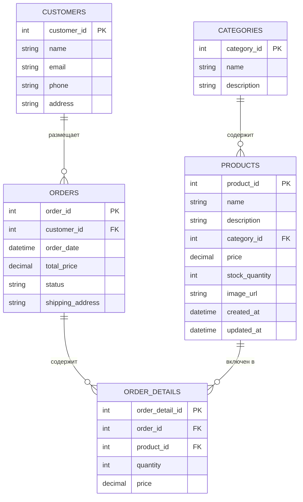

# 📚 Лабораторная работа №8: Spring Data, JPA, HikariCP, H2

## ✅ Цель работы

- Освоить работу с **Spring Data JPA**, **транзакциями**, **ORM** и **HikariCP**
- Создать полноценный Java-проект со следующими слоями:
  - сущности (Entity)
  - репозитории (Repository)
  - сервисы (Service)
  - клиент приложения (App)

---

## 📁 Структура пакетов

```
ru.bsu.cad.lab
├── app         # Клиент приложения
├── entity      # JPA-сущности
├── repository  # Интерфейсы репозиториев
└── service     # Логика и транзакции
```

---

## 🔧 Используемые технологии

- **Java 21**
- **Gradle**
- **H2 Database** (in-memory)
- **Hibernate ORM 6**
- **Spring Data JPA**
- **Spring ORM & Context**
- **HikariCP** (пул соединений)
- **Jakarta Persistence API**

---

## 🗃 Структура базы данных



---

## 🚀 Запуск приложения

> Для запуска выполните:

```bash
gradle run
```

- Создание схемы происходит автоматически
- CSV-файлы подгружаются (categories, products, customers)
- Создаётся новый заказ и логируется
- Выводится информация в консоль

---

## ❓ Вопросы и ответы для защиты

### 🧩 JPA

1. JPA (Java Persistence API) — это спецификация для ORM.
2. JPA — спецификация, Hibernate — реализация.
3. `@Entity` — делает класс JPA-сущностью.
4. `@Table` — задаёт имя таблицы.
5. `@Id` — первичный ключ.
6. `@GeneratedValue` — стратегия генерации ID.
7. Стратегии: AUTO, IDENTITY, SEQUENCE, TABLE.
8. `@Column(name = "...")` — имя колонки явно.
9. `@OneToMany` и `@ManyToOne`.
10. `@ManyToMany`, `@JoinTable`.

### 🧩 Spring Data

1. Spring Data — упрощает доступ к БД.
2. `CrudRepository` — базовые CRUD методы.
3. `JpaRepository` расширяет `CrudRepository`.
4. Создать интерфейс, унаследованный от JpaRepository.
5. `findById(id)`.
6. `save(entity)`.
7. `delete(entity)` или `deleteById(id)`.
8. `@Query("...")`.
9. `@Transactional` — управление транзакциями.
10. `@Entity`, `@Table`, `@Id`, `@GeneratedValue`, `@Column`, и др.

---

## 📦 Зависимости (Gradle)

```kotlin
dependencies {
    implementation("org.springframework:spring-context:6.1.5")
    implementation("org.springframework.data:spring-data-jpa:3.2.5")
    implementation("org.springframework:spring-orm:6.1.5")
    implementation("org.hibernate.orm:hibernate-core:6.4.4.Final")
    implementation("com.h2database:h2:2.2.224")
    implementation("jakarta.persistence:jakarta.persistence-api:3.1.0")
}
```

---

## 💡 Дополнительно

- Репозитории автоматически реализуются Spring
- Все транзакции в сервисах помечены `@Transactional`
- Создание заказа происходит в одной транзакции
