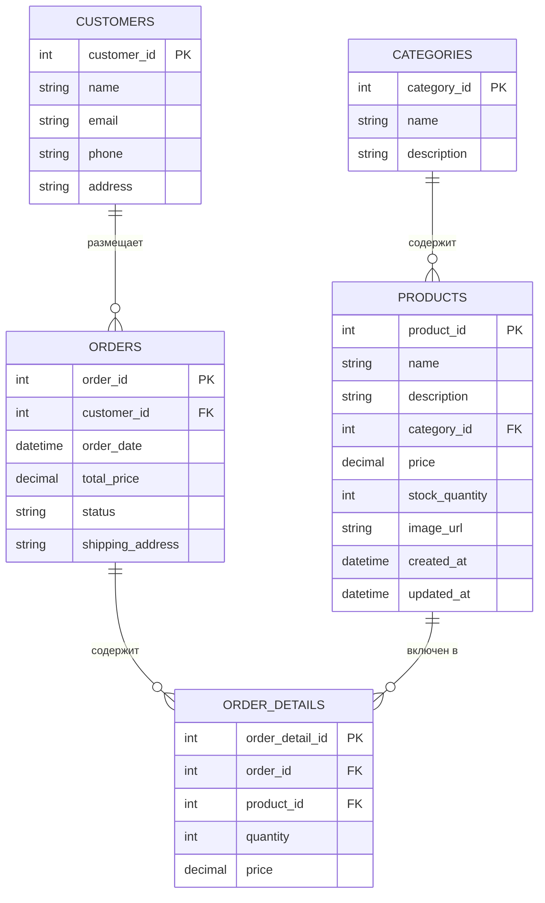

##Цель работы
- Освоить работу с Spring Data JPA, транзакциями, ORM и HikariCP
- Создать полноценный Java-проект со следующими слоями:
  - сущности (Entity)
  - репозитории (Repository)
  - сервисы (Service)
  - клиент приложения (App)

##Обновленная диаграмма

Контрольные вопросы:
JPA (Java Persistence API)
1. Что такое JPA и для чего оно используется?

JPA — это спецификация Java для управления, сохранения и извлечения объектов Java в реляционных базах данных. Используется для реализации ORM (Object-Relational Mapping), то есть сопоставления классов Java с таблицами БД.
2. Чем JPA отличается от Hibernate?

JPA — это стандарт, интерфейс, а Hibernate — это одна из реализаций JPA (другая, например, EclipseLink). Hibernate реализует спецификацию JPA и может использоваться как с ней, так и без неё.
3. Что делает аннотация @Entity?

Обозначает, что класс является JPA-сущностью и должен отображаться на таблицу базы данных.
4. Для чего нужна аннотация @Table?

Позволяет указать имя таблицы, к которой будет привязан класс. Без неё используется имя класса по умолчанию.

@Entity
@Table(name = "products")
public class Product { ... }

5. Как обозначить первичный ключ в JPA?

С помощью аннотации @Id.

@Id
private Long id;

6. Что делает аннотация @GeneratedValue?

Обозначает, что значение первичного ключа будет генерироваться автоматически (например, автоинкрементом).
7. Какие бывают стратегии генерации идентификаторов в JPA?

    GenerationType.AUTO — стратегия по умолчанию.

    GenerationType.IDENTITY — использует автоинкремент в БД.

    GenerationType.SEQUENCE — использует последовательности (sequence).

    GenerationType.TABLE — использует специальную таблицу.

8. Чем отличается @Column(name = "field_name") от использования имени поля напрямую?

Аннотация @Column(name = "field_name") явно указывает, к какому столбцу таблицы привязан атрибут. Без неё JPA использует имя поля по умолчанию.
9. Как задать связь “один ко многим” (@OneToMany) в JPA?

@OneToMany(mappedBy = "owner")
private List<Pet> pets;

10. Как задать связь “многие ко многим” (@ManyToMany) в JPA?

@ManyToMany
@JoinTable(
    name = "student_course",
    joinColumns = @JoinColumn(name = "student_id"),
    inverseJoinColumns = @JoinColumn(name = "course_id")
)
private Set<Course> courses;

Spring Data
1. Что такое Spring Data и зачем оно нужно?

Spring Data — это проект, упрощающий работу с базами данных. Позволяет создавать репозитории без реализации методов — они формируются автоматически на основе имени метода.
2. Что делает интерфейс CrudRepository?

Предоставляет базовые CRUD-операции (save, findById, delete, findAll и т.д.) для сущностей.
3. Чем JpaRepository отличается от CrudRepository?

JpaRepository расширяет CrudRepository и добавляет дополнительные методы: пагинация, сортировка, batch-операции и др.
4. Как создать свой репозиторий в Spring Data JPA?

public interface ProductRepository extends JpaRepository<Product, Long> {
}

5. Как выполнить поиск по ID с помощью Spring Data JPA?

Optional<Product> product = productRepository.findById(1L);

6. Как добавить новую запись в базу данных через Spring Data JPA?

Product product = new Product(...);
productRepository.save(product);

7. Как удалить объект из базы данных в Spring Data JPA?

productRepository.deleteById(1L);

8. Как написать свой SQL-запрос в Spring Data JPA?

@Query("SELECT p FROM Product p WHERE p.name = :name")
List<Product> findByName(@Param("name") String name);

Для нативного SQL:

@Query(value = "SELECT * FROM products WHERE name = :name", nativeQuery = true)
List<Product> findByNameNative(@Param("name") String name);

9. Что такое @Transactional и зачем она нужна?

Обозначает, что метод/класс должен выполняться в рамках транзакции. Используется для обеспечения согласованности данных.
10. Какие аннотации нужны для работы с JPA-сущностями?

    @Entity — для объявления сущности.

    @Table — для задания имени таблицы.

    @Id — для обозначения первичного ключа.

    @GeneratedValue — для авто-генерации ID.

    @Column — для конфигурации столбцов.

    @OneToMany, @ManyToOne, @ManyToMany, @OneToOne — для связей между сущностями.