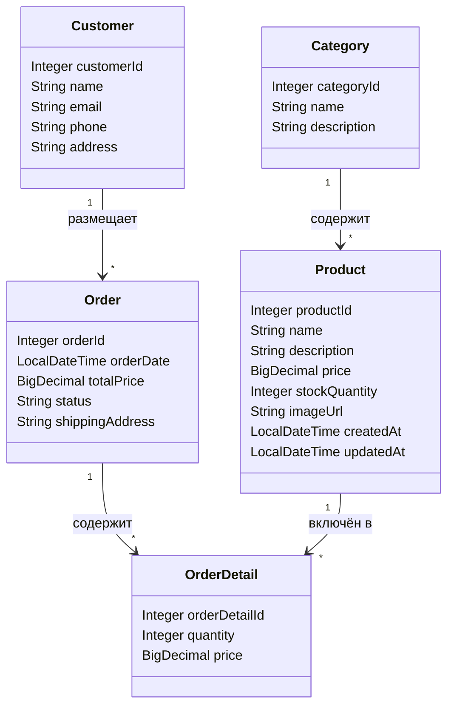

# Лабораторная работа №4
## Тема: Технологии работы с базами данных: JPA и Spring Data

### 📌 Цель работы
Перейти с JDBC на JPA, реализовать взаимодействие с базой данных через Spring Data JPA и ORM Hibernate, использовать H2, реализовать слоистую архитектуру и транзакции.

---

### 📁 Структура проекта

- `ru.bsuedu.cad.lab.entity` — JPA-сущности: `Category`, `Product`, `Customer`, `Order`, `OrderDetail`
- `ru.bsuedu.cad.lab.repository` — интерфейсы `JpaRepository` для каждой сущности
- `ru.bsuedu.cad.lab.service` — сервисы: `OrderService`, `CsvLoaderService`
- `ru.bsuedu.cad.lab.app` — основной запуск (`MainApp.java`)

---

### ⚙️ Запуск

```bash
gradle run
```

При запуске:
- загружаются данные из `CSV`,
- создаётся тестовый заказ,
- результат выводится в консоль.

---

### 📊 UML-диаграмма классов (Mermaid)



---

### ❓ Вопросы по JPA

**1. Что такое JPA и для чего оно используется?**  
JPA — спецификация Java для работы с базами данных через ORM. Позволяет отображать таблицы на классы.

**2. Чем JPA отличается от Hibernate?**  
JPA — стандарт. Hibernate — его реализация.

**3. Что делает аннотация `@Entity`?**  
Обозначает класс как сущность JPA.

**4. Для чего нужна аннотация `@Table`?**  
Позволяет указать имя таблицы и настройки.

**5. Как обозначить первичный ключ в JPA?**  
Через аннотацию `@Id`.

**6. Что делает аннотация `@GeneratedValue`?**  
Автоматически генерирует значение ID.

**7. Какие бывают стратегии генерации ID?**  
`AUTO`, `IDENTITY`, `SEQUENCE`, `TABLE`.

**8. Чем отличается `@Column(name="...")` от имени поля напрямую?**  
Позволяет задать имя столбца, если оно отличается от имени поля.

**9. Как задать связь один-ко-многим?**  
Через `@OneToMany` и `mappedBy`.

**10. Как задать связь многие-ко-многим?**  
С помощью `@ManyToMany` и промежуточной таблицы (`@JoinTable`).

---

### ❓ Вопросы по Spring Data

**1. Что такое Spring Data и зачем оно нужно?**  
Это надстройка над JPA, упрощающая работу с БД.

**2. Что делает интерфейс `CrudRepository`?**  
Обеспечивает базовые CRUD-операции.

**3. Чем `JpaRepository` отличается от `CrudRepository`?**  
Расширяет его и добавляет новые методы (пагинация, сортировка).

**4. Как создать репозиторий?**  
Наследовать интерфейс от `JpaRepository`.

**5. Как выполнить поиск по ID?**  
`repository.findById(id)`

**6. Как добавить новую запись?**  
`repository.save(entity)`

**7. Как удалить запись?**  
`repository.deleteById(id)` или `repository.delete(entity)`

**8. Как написать SQL-запрос?**  
С помощью аннотации `@Query`.

**9. Что такое `@Transactional`?**  
Обозначает метод или класс, выполняющийся в рамках транзакции.

**10. Какие аннотации нужны для JPA-сущностей?**  
`@Entity`, `@Id`, `@Table`, `@Column`, `@OneToMany`, `@ManyToOne` и др.