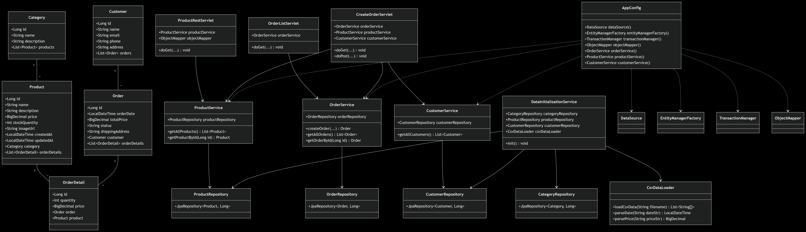
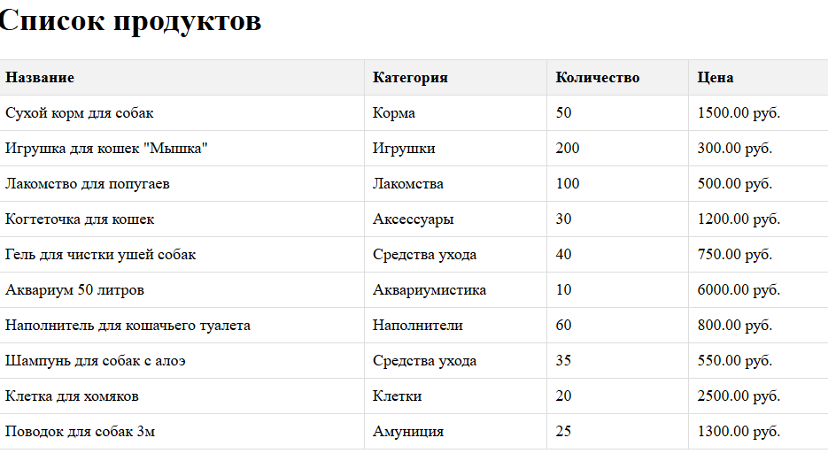
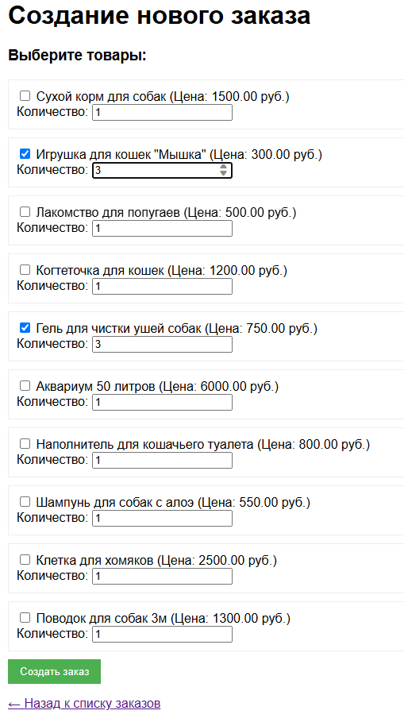
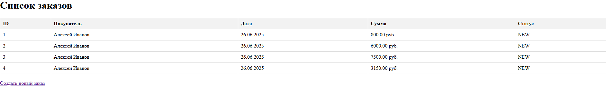

# Отчет по лаботаротоной работе №5. Разработка и развертывание Web-приложений
## Цель работы
Получить навыки разработки и развертывания Web-приложений.
## Выполнение работы
На рисунке представлена UML-диаграмма классов, дополненная новыми разработанными классами.



Код приложения располагается в директории [les10/lab](/les10/lab/) и реализован в соответствии с предложенными изменениями.

На рисунках ниже представлен результат выполнения реализованного функционала.






## Выводы
Получены навыки разработки и развертывания Web-приложений.
## Контрольные вопросы
1. Что такое Servlet и зачем он нужен?

Servlet — это Java-класс, обрабатывающий HTTP-запросы и формирующий HTTP-ответы на сервере. Он работает внутри Servlet-контейнера (например, Tomcat) и служит основой Java Web-приложений.
Назначение:
* Обработка запросов от клиента (браузера)
* Генерация HTML-страниц или JSON
* Взаимодействие с бизнес-логикой и базой данных
2. Что делает web.xml и зачем он нужен в веб-приложении?

`web.xml` — это декларативный файл конфигурации Java EE веб-приложения (располагается в `WEB-INF/`).
Основные задачи:
* Определение сервлетов и маппинга URL
* Назначение фильтров и слушателей
* Установка параметров и безопасности
* Управление жизненным циклом компонентов
3. Что такое WAR-файл и чем он отличается от JAR?

WAR (Web Application Archive) — архив для развёртывания веб-приложений. Содержит `web.xml`, сервлеты, JSP, HTML, CSS, ресурсы и библиотеки.
JAR (Java Archive) — архив для библиотек и обычных Java-приложений.
4. Что такое `ServletContext` и как его использовать?

`ServletContext` — интерфейс, представляющий контекст всего веб-приложения, общий для всех сервлетов.
Возможности:
* Доступ к ресурсам (`getResourceAsStream`)
* Установка общих атрибутов (`setAttribute`, `getAttribute`)
* Получение параметров из `web.xml`
* Логирование (`log()`)
```java
ServletContext context = getServletContext();
context.setAttribute("appStartTime", LocalDateTime.now());
```
5. Чем отличается `HttpServletRequest` от `HttpServletResponse`?

`HttpServletRequest` - входящий HTTP-запрос от клиента. `HttpServletResponse` - исходящий HTTP-ответ клиенту.

6. Какой интерфейс нужно реализовать, чтобы создать Listener, реагирующий на запуск приложения?

`ServletContextListener` — интерфейс для обработки событий инициализации и уничтожения контекста.
7. Как получить доступ к Spring `ApplicationContext` внутри обычного сервлета?

Через `WebApplicationContextUtils`:
```java
WebApplicationContext context = WebApplicationContextUtils
        .getRequiredWebApplicationContext(getServletContext());
MyService service = context.getBean(MyService.class);


```
8. Что делает `ContextLoaderListener` в Spring-приложении?

`ContextLoaderListener` — загружает корневой Spring ApplicationContext при запуске приложения.
Создаёт `ApplicationContext`, связывает его с `ServletContext`, делает его доступным для всех компонентов.
9. Зачем нужно использовать `@WebServlet` и чем он лучше/хуже конфигурации в `web.xml`?

`@WebServlet` — аннотация Java EE 6+, позволяющая регистрировать сервлеты без `web.xml`.
Преимущества:
* Меньше XML, проще читается
* Быстрая регистрация сервлета прямо в коде
Недостатки:
* Менее удобно при масштабной конфигурации
* Труднее централизовать настройки (например, безопасности)
web.xml лучше, если требуется конфигурируемость без перекомпиляции.
10. Как можно использовать один Spring Bean в нескольких сервлетах?

Поскольку Spring Beans находятся в ApplicationContext можно получить его в каждом сервлете через:
```java
WebApplicationContext context = WebApplicationContextUtils
        .getRequiredWebApplicationContext(getServletContext());
MyBean bean = context.getBean(MyBean.class);
```
или как Bean по умолчанию - singleton, и будет одним и тем же экземпляром для всех сервлетов.