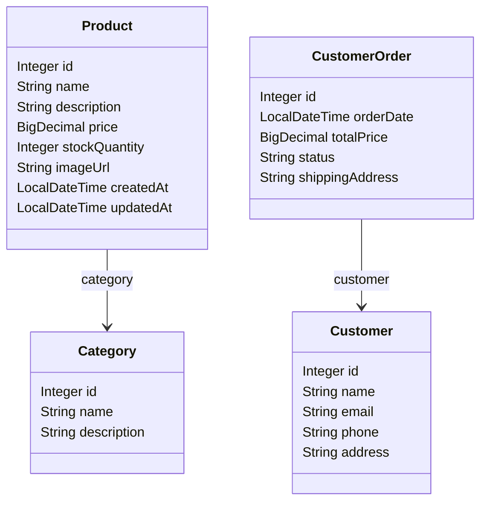

# Отчет о лаботаротоной работе

## Цель работы


Познакомиться с созданием и развертыванием Java Web-приложения, использующего сервлеты, REST API и Spring Data JPA для доступа к данным.  
Освоить процесс сборки WAR-архива и деплоя на сервер приложений Apache Tomcat. Получить навыки интеграции HTML-форм с backend-логикой через сервлеты.

---

## Выполненные шаги

### 1. Исходный код  
Результат лабораторной №4 перенесён в директорию:  
`/les10/lab/`

### 2. Apache Tomcat 11  
* Загружен и установлен с официального сайта: [https://tomcat.apache.org](https://tomcat.apache.org)  


### 3. Настройка пользователя  
В `tomcat-users.xml`:
```xml
<tomcat-users>
  <user username="admin" password="admin" roles="manager-gui,admin-gui"/>
</tomcat-users>
```

### 4. Настройка проекта  
Добавлен плагин WAR, настроена структура.  
Команда сборки:
```bash
./gradlew clean build war
```

### 5. Сервлет: Список заказов  
Класс: `OrderListServlet`  
URL: `/orders`  
Формирует таблицу заказов с кнопкой для создания нового:
```java
@WebServlet("/orders")
public class OrderListServlet extends HttpServlet {
    // ...
}
```

### 6. Сервлет: Создание заказа  
Класс: `OrderFormServlet`  
URL: `/create-order`  
Форма ввода ID клиента и товаров. После отправки — заказ сохраняется и идёт редирект на `/orders`.

```java
@WebServlet("/create-order")
public class OrderFormServlet extends HttpServlet {
    @Autowired private CustomerRepository customerRepository;
    @Autowired private ProductRepository productRepository;
    @Autowired private OrderRepository orderRepository;
    // ...
}
```

### 7. Сервлет: REST API по продуктам  
Класс: `ProductApiServlet`  
URL: `/api/products`  
JSON-ответ с информацией о товарах:
```java
@WebServlet("/api/products")
public class ProductApiServlet extends HttpServlet {
    protected void doGet(HttpServletRequest req, HttpServletResponse resp) {
        // Чтение из базы и сериализация в JSON
    }
}
```

### 8. Сборка WAR-файла  
Команда:
```bash
./gradlew war
```
Результат: `build/libs/lab10.war`

### 9. Деплой и тестирование  
WAR-файл размещён в `webapps/`.  
Tomcat запущен: `./startup.sh`  
REST-сервис протестирован через **Postman**:
```http
GET http://localhost:8080/lab10/api/products
```
[
    {
        "name": "Сухой корм для собак",
        "category": "Корма",
        "stockQuantity": 50
    },
    {
        "name": "Игрушка для кошек \"Мышка",
        "category": "Игрушки",
        "stockQuantity": 200
    },
    {
        "name": "Лакомство для попугаев",
        "category": "Лакомства",
        "stockQuantity": 100
    },
    {
        "name": "Когтеточка для кошек",
        "category": "Аксессуары",
        "stockQuantity": 30
    },
    {
        "name": "Гель для чистки ушей собак",
        "category": "Средства ухода",
        "stockQuantity": 40
    },
    {
        "name": "Аквариум 50 литров",
        "category": "Аквариумистика",
        "stockQuantity": 10
    },
    {
        "name": "Наполнитель для кошачьего туалета",
        "category": "Наполнители",
        "stockQuantity": 60
    },
    {
        "name": "Шампунь для собак с алоэ",
        "category": "Средства ухода",
        "stockQuantity": 35
    },
    {
        "name": "Клетка для хомяков",
        "category": "Клетки",
        "stockQuantity": 20
    },
    {
        "name": "Поводок для собак 3м",
        "category": "Амуниция",
        "stockQuantity": 25
    }
]

### 🔎 10. UML-диаграмма классов (Mermaid)



---

##  Вывод

Разработано и развернуто полноценное Web-приложение с поддержкой:
- работы с базой данных через Spring Data JPA;
- HTML-интерфейсов на сервлетах;
- REST API;
- сборки WAR и деплоя на Apache Tomcat 11.


