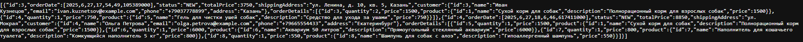

# Отчет по лаботаротоной работе №6. Разработка Web-приложений с использованием технологии Spring MVC
## Цель работы
Получить навыки разработки Web-приложений с использованием технологии Spring MVC.
## Выполнение работы
На рисунке представлена UML-диаграмма классов, дополненная новыми разработанными классами.


Код приложения располагается в директории [les12/lab](/les12/lab/) и реализован в соответствии с предложенными изменениями.

На рисунках ниже представлен результат выполнения реализованного функционала.


##### Главная страница


##### Список товаров


##### Создание заказа


##### Список заказов


##### Просмотр заказа


##### Редактирование заказа


##### Страница просмотра после редактирования заказа


##### Список заказов после удаления заказа №2

Далее будет продемонстрировано тестирование REST контроллера.


##### Получение всех заказов


##### Получение заказа с ID #3


##### Создание нового заказа через Postman (POST)


##### Получение только что созданного заказа


##### Изменение нового заказа через Postman (PUT)


##### Получение только что измененного заказа


##### Удаление только что созданного заказа


## Выводы
Получены навыки разработки и развертывания Web-приложений.
## Контрольные вопросы
1. Что означает аббревиатура MVC и каковы её основные компоненты?

MVC (Model-View-Controller) — это архитектурный паттерн, разделяющий приложение на три компонента:
* Model (Модель) — содержит бизнес-логику и данные.
* View (Представление) — отвечает за отображение данных (HTML, JSON, XML и т.д.).
* Controller (Контроллер) — обрабатывает запросы, взаимодействует с Model и возвращает View.
2. Какую роль выполняет `DispatcherServlet` в Spring MVC?

`DispatcherServlet` — это центральный диспетчер, который:
* Принимает все HTTP-запросы.
* Делегирует обработку соответствующим контроллерам.
* Управляет жизненным циклом запроса (вызывает `ViewResolver`, `HandlerAdapter` и др.).
* Возвращает клиенту результат (HTML, JSON и т.д.).
3. Какая аннотация используется для указания, что класс является контроллером?

`@Controller` — для классических MVC-контроллеров (возвращает имя представления).
`@RestController` (частный случай `@Controller` + `@ResponseBody`) — для REST API (возвращает JSON/XML).
4. Чем отличаются аннотации @Controller и @RestController?

`@Controller` возвращает имя представления (например, `"orders/list"`), которое обрабатывается `ViewResolver`.
`@RestController` автоматически добавляет `@ResponseBody` ко всем методам, позволяя возвращать JSON/XML.
5. Какой аннотацией можно связать параметр метода с переменной из URL (например, /users/{id})?

`@PathVariable`:
```java
@GetMapping("/users/{id}")
public String getUser(@PathVariable Long id) { }
```
6. Что такое Model в Spring MVC и как она используется?

`Model` — это интерфейс для передачи данных между контроллером и представлением.
```java
@GetMapping("/orders")
public String getOrders(Model model) {
    model.addAttribute("orders", orderService.getAllOrders());
    return "orders/list";
}
```
7. Что делает аннотация @RequestMapping?

Определяет маппинг URL на методы контроллера. Может использоваться на уровне класса или метода.
8. Какие HTTP-методы можно обрабатывать в Spring MVC и какими аннотациями?

* `@GetMapping` (GET)
* `@PostMapping` (POST)
* `@PutMapping` (PUT)
* `@DeleteMapping` (DELETE)
* `@PatchMapping` (PATCH)
9. Что такое ViewResolver и зачем он нужен в Spring MVC?

`ViewResolver` преобразует логическое имя представления (например, `"orders/list"`) в конкретное представление (HTML-страницу).
10. Как вернуть JSON из контроллера без использования шаблонов?

Использовать `@RestController`, возвращая объект, Spring автоматически конвертирует его в JSON через `Jackson`.

