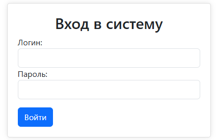
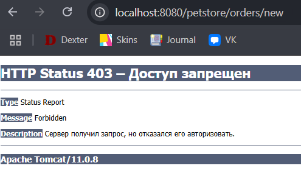
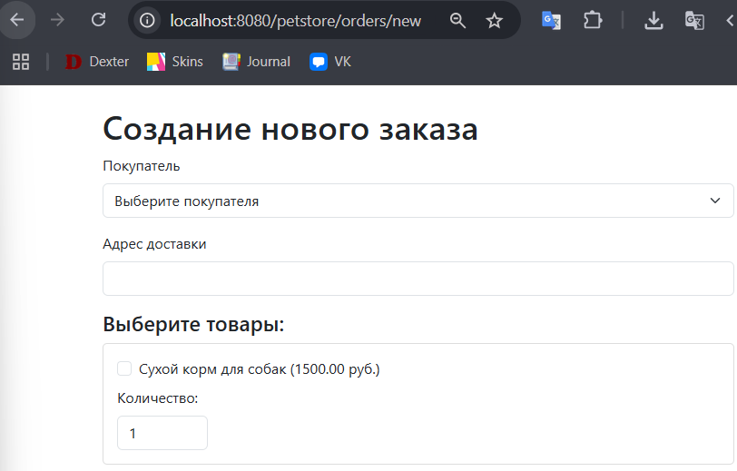
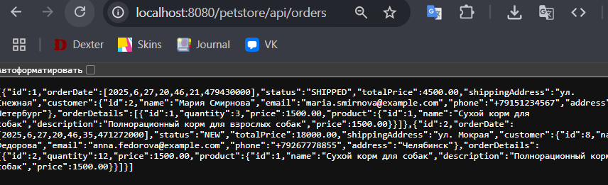
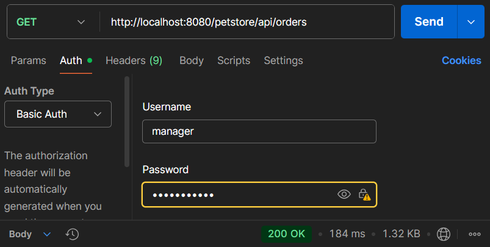
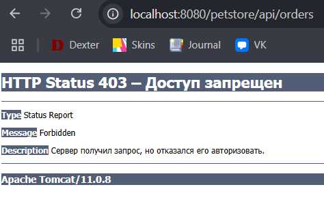
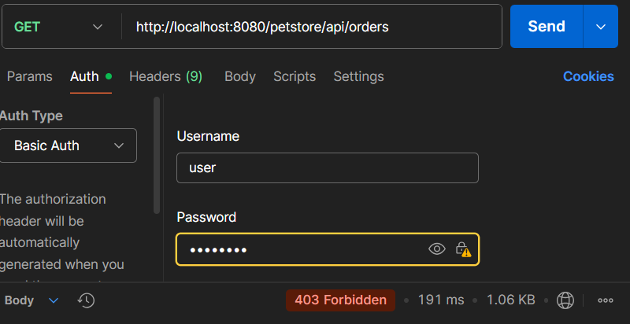

# Отчет по лаботаротоной работе №7. Spring security. Basic Authentication
## Цель работы
Научиться работать с Spring Security и Basic Authentication.
## Выполнение работы
На рисунке представлена UML-диаграмма классов, дополненная новыми разработанными классами.


Код приложения располагается в директории [les14/lab](/les14/lab/) и реализован в соответствии с предложенными изменениями.

На рисунках ниже представлен результат выполнения реализованного функционала.



#### Страница входа в приложение

После успешного входа происходит переход на главную страницу, где можно просмотреть заказы, создать новый заказ и просмотреть товары.
При авторизации как пользователь можно только посмотреть заказы, если нажать на создание нового заказа, то произоойдет ошибка доступа, прсдетавленная на рисунке ниже.



#### Ошибка доступа

При авторизации как менеджер, есть доступ ко всем пунктам меню, включая создание нового заказа.



#### Создание нового заказа

Так же был реализован доступ к REST контроллеру только для менеджера.




#### Доступ менеджера к API



#### Доступ пользователя к API


## Выводы
Получены навыки работы с Spring Security и Basic Authentication.
## Контрольные вопросы
1. Что такое Spring Security и зачем он используется?

Spring Security — это мощный и настраиваемый фреймворк для аутентификации и авторизации в приложениях на базе Spring. Он обеспечивает защиту как веб-приложений, так и REST API, предоставляя механизмы:
* аутентификации пользователей;
* авторизации доступа к ресурсам;
* защиты от CSRF, XSS, session fixation и других атак;
* интеграции с LDAP, OAuth2, JWT и т. д.
2. Чем отличается аутентификация от авторизации?

Аутентификация - процесс проверки личности пользователя. Авторизация - процесс проверки прав пользователя.
3. Что такое `SecurityFilterChain` и какова его роль в приложении?

`SecurityFilterChain` — это цепочка фильтров, применяемых ко всем входящим HTTP-запросам. Она отвечает за:
* перехват запроса;
* проверку подлинности;
* проверку прав доступа;
* редиректы на логин/ошибку и т. д.
4. Как работает form-based аутентификация в Spring Security?

1. Пользователь переходит к защищённому ресурсу.
2. Перенаправляется на login-страницу (`/login` по умолчанию).
3. Вводит логин и пароль.
4. Spring проверяет данные через `UserDetailsService`. 
5. При успехе — перенаправление на исходный URL или главную страницу.
5. Что такое UserDetailsService и зачем он нужен?

`UserDetailsService` — интерфейс, загружающий данные пользователя по логину. Используется для получения:
* имени пользователя, 
* пароля (в зашифрованном виде), 
* ролей (GrantedAuthority).
6. Как задать роли пользователям и проверять их в коде?

Через `UserDetailsService` или в памяти:
```java
.inMemoryAuthentication()
    .withUser("user").password("{noop}123").roles("USER")
    .and()
    .withUser("admin").password("{noop}123").roles("ADMIN");
```
Проверить роли в контроллерах:
```java
@PreAuthorize("hasRole('ADMIN')")
@GetMapping("/admin")
public String adminPage() {  }

```
Проверить роли в URL:
```java
    http.authorizeHttpRequests()
    .requestMatchers("/admin/**").hasRole("ADMIN");
```
7. Что такое Basic Authentication и когда её удобно использовать?

Basic Auth — простейший механизм, при котором логин и пароль передаются в HTTP-заголовке Authorization: Basic.
Когда использовать:
* REST API без пользовательского интерфейса;
* тестирование с Postman/cURL;
* при наличии HTTPS.
8. Как запретить доступ к URL-адресу без соответствующей роли?

```java
http
  .authorizeHttpRequests()
  .requestMatchers("/admin/**").hasRole("ADMIN")
  .requestMatchers("/user/**").hasAnyRole("USER", "ADMIN")
  .anyRequest().authenticated();
```
9. Как сделать свою станицу для входа(custom login page)?

```java
// Security Config
http.formLogin()
    .loginPage("/my-login")
    .loginProcessingUrl("/process-login")
    .defaultSuccessUrl("/home")
    .permitAll();

// Controller
@GetMapping("/my-login")
public String loginPage() {
    return "login";
}
```
10. Можно ли использовать одновременно form login и basic auth в одном проекте?

Да, можно, но осторожно:
* Basic Auth будет использоваться для API;
* Form-based — для веб-интерфейса.

```java
http
    .securityMatcher("/api/**")
    .authorizeHttpRequests(auth -> auth.anyRequest().authenticated())
    .httpBasic();

http
    .securityMatcher("/**")
    .authorizeHttpRequests(auth -> auth.anyRequest().authenticated())
    .formLogin();
```