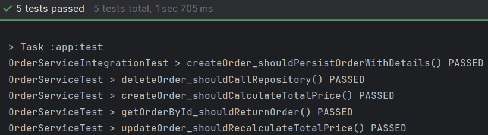
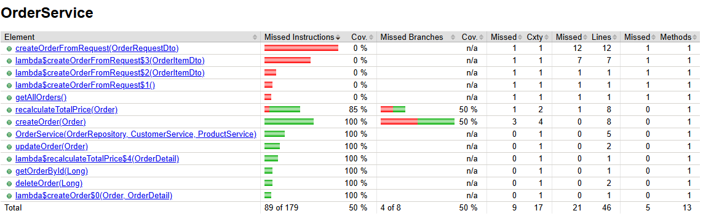

# Отчет по лаботаротоной работе №8. Основы тестирования
## Цель работы
Научиться применять и писать интеграционные и Unit-тесты.
## Выполнение работы

Код приложения располагается в директории [les16/lab](/les14/lab/) и реализован в соответствии с предложенными изменениями.

На рисунках ниже представлен результат выполнения реализованного функционала.


#### Успешное прохождение всех тестов


#### Отчет JaCoCO о покрытии кода тестами

## Выводы
Получены навыки применения и написания интеграционных и Unit-тестов.
## Контрольные вопросы
1. Что такое модульное тестирование и чем оно отличается от интеграционного?

Модульное тестирование проверяет отдельные компоненты (юниты) приложения изолированно. Отличается от интеграционного тем, что:
* Тестирует один класс/метод
* Использует моки/стабы для зависимостей
* Выполняется быстро
* Не требует поднятия контекста Spring
* Пример модульного теста: тестирование метода `calculateTotalPrice()` в `OrderService` с моками для репозиториев.
2. Какие фреймворки чаще всего используются для модульного тестирования в Java?

Популярные фреймворки для модульного тестирования в Java:
* JUnit 5 (основной)
* Mockito (для мокинга)
* AssertJ (удобные assertions)
* TestNG (альтернатива JUnit)
* EasyMock (альтернатива Mockito)
3. Зачем используют заглушки (stubs) и моки (mocks) в тестах?

Заглушки (stubs) и моки (mocks) используются для изоляции тестируемого кода, чтобы эмулировать поведение зависимостей, для проверки взаимодействия между объектами.
Пример: Mock `OrderRepository` в тестах `OrderService`.
4. Что именно обычно тестируется в модульном тесте?

В модульном тесте обычно тестируется:
* Логика одного метода
* Обработка входных параметров
* Возвращаемые значения
* Исключительные ситуации
Пример: проверка, что `OrderService` корректно вычисляет `totalPrice`.
5. Как обеспечить изоляцию тестируемого класса от внешних зависимостей?

Изоляция тестируемого класса обеспечивается:
* Через внедрение зависимостей (DI)
* Использованием `Mockito` для создания моков
* Аннотациями `@Mock` и `@InjectMocks`
Пример:
```java
@Mock
private OrderRepository orderRepo;

@InjectMocks
private OrderService orderService;
```
6. Можно ли в модульном тесте подключать базу данных? Почему?

В модульном тесте не следует подключать реальную БД, потому что это нарушает принцип изоляции, замедляет выполнение тестов, делает тесты зависимыми от внешней инфраструктуры, вместо БД используют моки репозиториев.
7. Что проверяется при интеграционном тестировании?

При интеграционном тестировании проверяется взаимодействие между компонентами, работа с реальной БД, корректность конфигурации Spring, транзакционное поведение.
Пример: тест сохранения `Order` в БД через `OrderService`.
8. Какие компоненты системы должны быть доступны во время интеграционного теста?

В интеграционном тесте должны быть доступны реальные репозитории, тестовая БД (обычно H2), сервисный слой, контекст Spring, но внешние сервисы можно мокать.
9. В чём преимущество использования тестовой (встраиваемой) базы данных, например H2, при интеграционном тестировании?

Преимущества H2 для интеграционного тестирования: быстрая инициализация, изоляция тестов, не требует настройки реальной БД, поддержка SQL, совместимого с основными СУБД, возможность работать в in-memory режиме.
10. Как определить, что тест является интеграционным, а не модульным?

Тест является интеграционным, если:
* Использует `@SpringBootTest`
* Поднимает контекст Spring
* Работает с реальной/встраиваемой БД
* Тестирует взаимодействие нескольких компонентов
* Выполняется медленнее модульных тестов
Пример:
```java
@SpringBootTest
@Transactional
class OrderServiceIntegrationTest {
    @Autowired
    private OrderRepository repository;
}
```